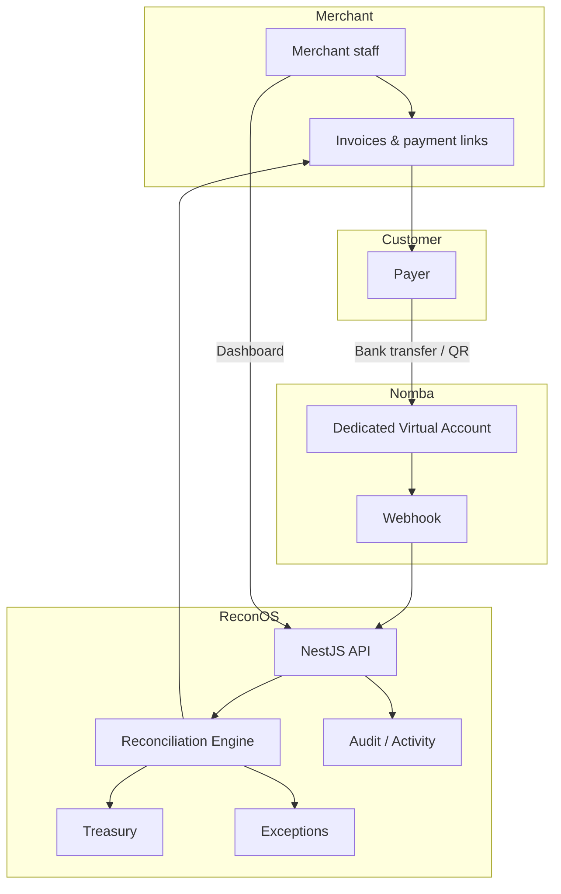
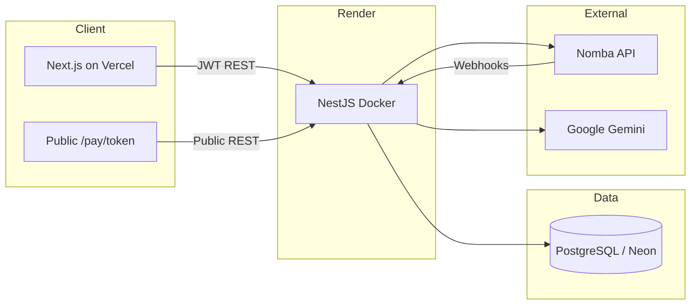
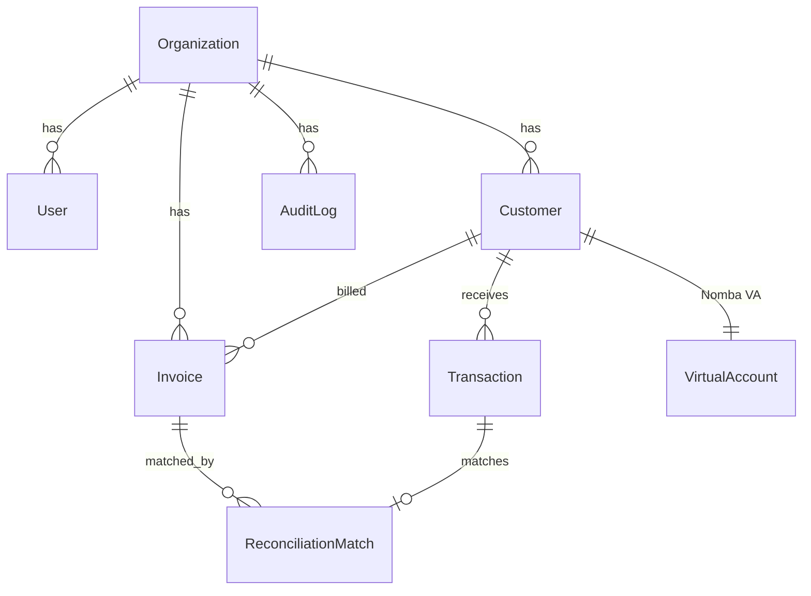
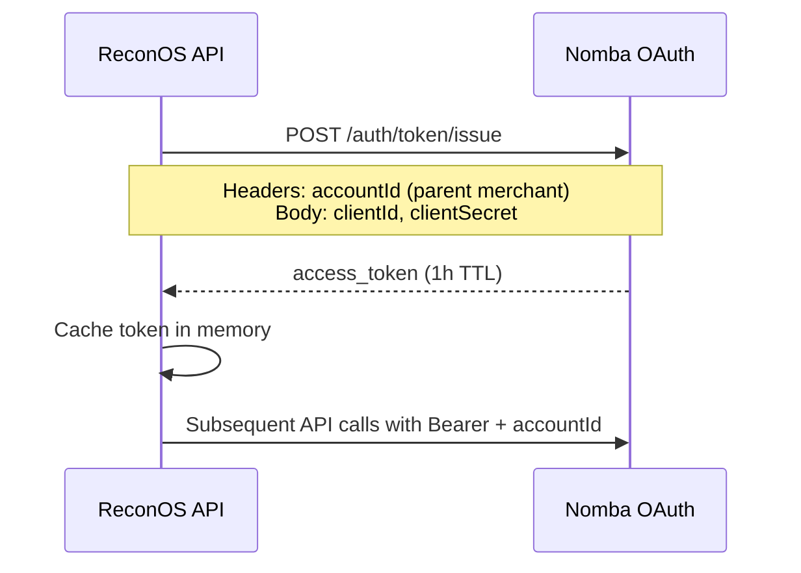
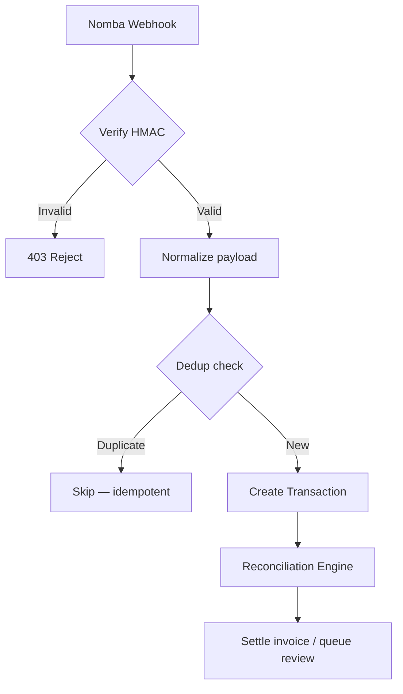
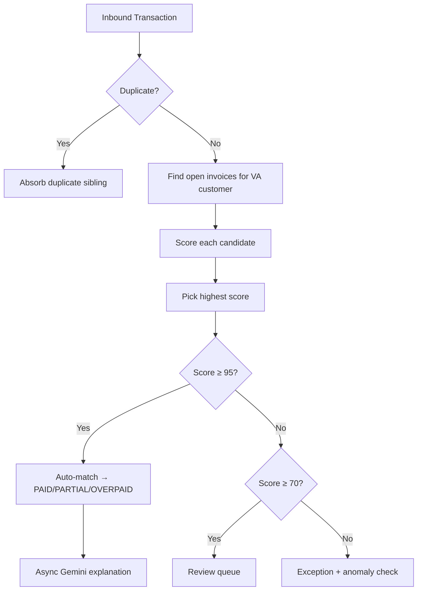
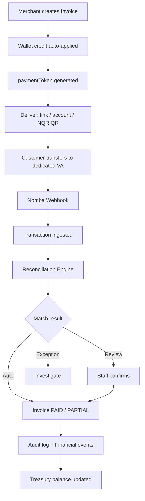
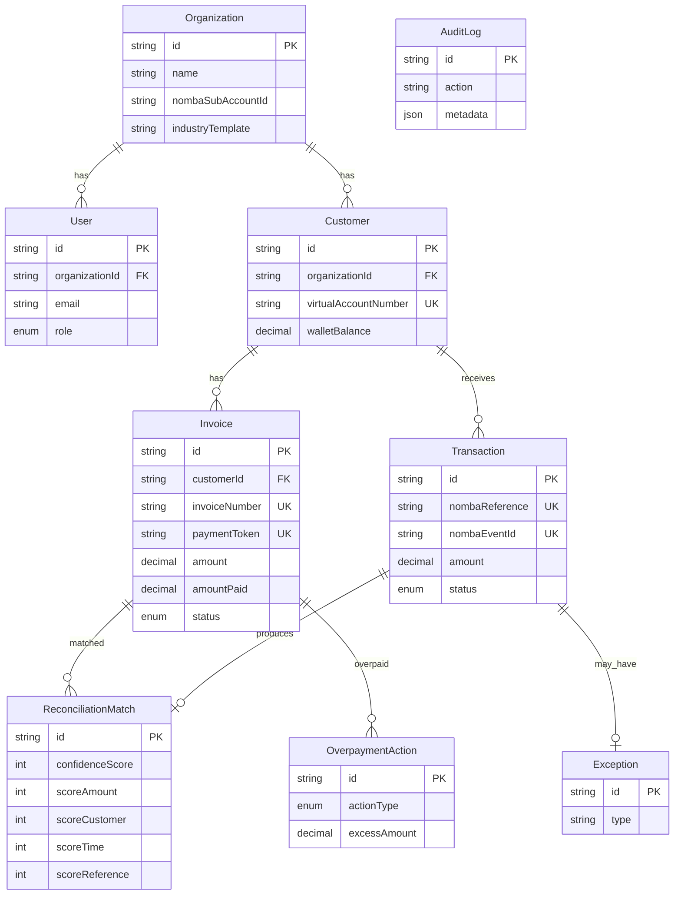

# ReconOS — Developer Documentation

**Nomba API Hackathon 2026** · Version 1.0

> Technical architecture document for judges and engineering review.  
> Repository: [github.com/Feelzcode/ReconOS](https://github.com/Feelzcode/ReconOS)

---

## Table of Contents

1. [Introduction](#1-introduction)
2. [Problem Statement](#2-problem-statement)
3. [Solution Overview](#3-solution-overview)
4. [System Architecture](#4-system-architecture)
5. [Technology Stack](#5-technology-stack)
6. [Multi-Tenant Design](#6-multi-tenant-design)
7. [Nomba API Integrations](#7-nomba-api-integrations)
8. [Reconciliation Engine](#8-reconciliation-engine)
9. [Payment Lifecycle](#9-payment-lifecycle)
10. [Treasury](#10-treasury)
11. [Recovery Mechanism](#11-recovery-mechanism)
12. [Security](#12-security)
13. [Database Design](#13-database-design)
14. [API Reference](#14-api-reference)
15. [Webhooks Reference](#15-webhooks-reference)
16. [Deployment](#16-deployment)
17. [Setup & Installation](#17-setup--installation)
18. [Error Codes & Troubleshooting](#18-error-codes--troubleshooting)
19. [Future Roadmap](#19-future-roadmap)

---

## 1. Introduction

**ReconOS is a payment reconciliation platform built on the Nomba API** that enables organizations to automatically reconcile bank transfers made into **dedicated payment accounts** (Nomba Virtual Accounts).

ReconOS is **not** a school management system, a generic invoicing app, or a POS. It is a **payment operations layer** that sits between inbound bank transfers and merchant bookkeeping — matching every naira to the correct invoice, surfacing exceptions, and maintaining a full audit trail.

### Target industries

ReconOS uses industry templates so the same engine speaks the merchant's language:

| Template | Customer label | Example use case |
|----------|----------------|------------------|
| `education` | Students | Term fees, levies, uniforms |
| `property` | Tenants | Rent, caution fee, service charge |
| `healthcare` | Patients | Consultation, lab tests |
| `logistics` | Clients | Shipments and deliveries |
| `custom` | Configurable | Churches, cooperatives, associations |

The database model stays `Customer` / `Invoice`; only UI labels change.

---

## 2. Problem Statement

Organizations that collect via **bank transfers** (especially in Nigeria) struggle with:

| Pain | Impact |
|------|--------|
| Manual invoice reconciliation | Staff spend hours matching transfers to invoices |
| Identifying who paid | Shared account numbers obscure payer identity |
| Partial & overpayments | Hard to apply correctly across multiple invoices |
| Webhook failures | Payments arrive at the bank but never hit internal systems |
| Weak audit trails | Disputes with parents, tenants, or patients |
| Treasury blindness | No single view of collected vs outstanding vs available |

**ReconOS solves these** by combining **Nomba Virtual Accounts** (one dedicated account per customer) with an **intelligent reconciliation engine** that scores, matches, and settles payments — with recovery when webhooks fail.

---

## 3. Solution Overview



**Core value:** Every inbound transfer is ingested, deduplicated, scored against open invoices, and either auto-settled or routed to human review — with wallet credits for overpayments and sync-based recovery when webhooks are missed.

---

## 4. System Architecture

### 4.1 Production topology



### 4.2 Backend modules

| Module | Path | Responsibility |
|--------|------|----------------|
| `auth` | `src/auth/` | JWT login, org registration, industry setup |
| `customers` | `src/customers/` | CRUD + Nomba VA provisioning |
| `invoices` | `src/invoices/` | Billing, wallet apply, `paymentToken` |
| `pay` | `src/pay/` | Public payment page API |
| `webhooks` | `src/webhooks/` | Nomba ingestion + signature verification |
| `reconciliation` | `src/reconciliation/` | Engine, sync, recovery, wallet |
| `transactions` | `src/transactions/` | Merchant transaction list & timeline |
| `exceptions` | `src/exceptions/` | Unmatched / anomalous payments |
| `treasury` | `src/treasury/` | Sub-account balance, withdrawals |
| `audit` | `src/audit/` | Immutable activity log |
| `insights` | `src/insights/` | Dashboard aggregates |
| `ai` | `src/ai/` | Gemini match explanations (optional) |
| `nomba` | `src/nomba/` | Nomba provider abstraction |

### 4.3 Background processing

ReconOS uses **NestJS `@nestjs/schedule`** (cron) — not a separate worker process:

| Job | Schedule | Service |
|-----|----------|---------|
| Hourly transaction sync | `0 * * * *` | `TransactionSyncService` |
| Nightly deep sync | `03:00 daily` | `TransactionSyncService` |
| Overdue invoice sweep | Midnight | `InvoicesService` |
| AI explanation backfill | `02:00 daily` | `ReconciliationService` |

> **Note:** Redis is on the roadmap for webhook buffering at scale; v1.0 uses PostgreSQL + in-process cron.

---

## 5. Technology Stack

### Frontend

| Technology | Version | Purpose |
|------------|---------|---------|
| Next.js | 14 | App router, SSR/SSG |
| React | 18 | UI components |
| TypeScript | 5 | Type safety |
| Tailwind CSS | 3 | Design system |
| TanStack Query | 5 | Server state |
| Zustand | 4 | Auth session |
| Recharts | 2 | Dashboard charts |

### Backend

| Technology | Version | Purpose |
|------------|---------|---------|
| NestJS | 10 | Modular API framework |
| Prisma | 5 | ORM + migrations |
| PostgreSQL | 15+ | Primary datastore (Neon in prod) |
| Passport JWT | — | Authentication |
| `@nestjs/schedule` | 4 | Cron jobs |

### Infrastructure

| Layer | Production |
|-------|------------|
| Frontend hosting | Vercel |
| API hosting | Render (Docker) |
| Database | Neon PostgreSQL |
| Payments rail | Nomba API |
| AI (optional) | Google Gemini |

### Authentication

- **JWT access tokens** (15m default) + refresh tokens (7d)
- Bearer token on all merchant routes
- Public routes: `GET /api/pay/:token`, `GET /api/auth/templates`, `POST /api/webhooks/nomba`

---

## 6. Multi-Tenant Design

ReconOS is **multi-tenant at the organization level**. Every merchant signs up as an `Organization`; all data is scoped by `organizationId`.



### Isolation model

| Entity | Scoped by `organizationId` |
|--------|---------------------------|
| Customers | Yes |
| Invoices | Yes |
| Transactions (via customer) | Yes |
| Treasury / sub-account | Yes (one Nomba sub-account per org) |
| Audit logs | Yes |
| Payment links (`paymentToken`) | Yes (via invoice) |

**Enforcement:** `JwtStrategy` extracts `organizationId` from the token. Every service method filters queries by org — client-supplied org IDs are never trusted.

### Industry-native vocabulary

Merchants see "Students" or "Tenants" in the UI; the API and database remain `Customer`. Vocabulary sanitization (`merchant-vocabulary.ts`) ensures Nomba/internal terms never appear in merchant-facing copy.

---

## 7. Nomba API Integrations

> **This is the core hackathon integration surface.** ReconOS wraps all Nomba calls behind `NombaProvider` (`src/nomba/nomba.interface.ts`) with a mock implementation for local dev (`USE_MOCK_NOMBA=true`).

### 7.1 Integration summary table

| Category | Nomba endpoint | ReconOS usage | Purpose |
|----------|----------------|---------------|---------|
| **Authentication** | `POST /auth/token/issue` | `NombaProvider.getAccessToken()` | OAuth with `clientId` + `clientSecret`; `accountId` header; 1h token cache |
| **Virtual Accounts** | `POST /accounts/virtual` | `CustomersService.create()` | Dedicated VA per customer on create |
| **Virtual Accounts** | VA lookup by ref | Customer provisioning | Retrieve account number / bank name |
| **Transactions** | Virtual account history API | `TransactionSyncService` | Hourly + nightly sync for missed webhooks |
| **Transaction Requery** | `GET /transactions/requery/{sessionId}` | `TransactionsController.verify` | Manual payment verification |
| **Transfers** | `POST /transfers/bank` | `TreasuryService.withdraw()` | Merchant withdrawals & refunds |
| **Bank Lookup** | `POST /transfers/bank/lookup` | `TreasuryController.lookup` | Verify destination before transfer |
| **Sub-accounts** | Sub-account create API | Org onboarding / treasury | Per-merchant ledger on Nomba |
| **Sub-accounts** | Balance inquiry | `TreasuryService` | Available balance display |
| **Webhooks** | Payment events → our URL | `WebhooksController` | Real-time ingestion |

### 7.2 Authentication flow



**Environment variables:** `NOMBA_CLIENT_ID`, `NOMBA_CLIENT_SECRET`, `NOMBA_ACCOUNT_ID`, `NOMBA_SUBACCOUNT_ID`, `NOMBA_BASE_URL`

**Amount boundary:** Nomba uses **kobo**; ReconOS stores **Naira**. Conversion happens only in `nomba.provider.ts`.

### 7.3 Virtual account provisioning

When a merchant creates a customer:

```
POST /api/customers
  → CustomersService
  → NombaProvider.createVirtualAccount({ accountRef, accountName, subAccountId })
  → POST /accounts/virtual
  → Store virtualAccountNumber, bankName, nombaAccountId on Customer
```

### 7.4 Webhooks

**Inbound URL (production):**

```
POST https://reconos-api.onrender.com/api/webhooks/nomba
```

**Signature verification:**

- Header: `nomba-signature`
- Algorithm: **HMAC-SHA256** (not SHA512)
- Secret: `NOMBA_WEBHOOK_SECRET`
- Implementation: `src/nomba/nomba-webhook.util.ts`

**Processing pipeline:**



**Idempotency layers:**

1. `nombaEventId` unique constraint
2. `nombaReference` unique constraint
3. Fingerprint: same VA + amount ± 2 minutes → duplicate sibling absorbed

### 7.5 Sandbox vs production

| Setting | Development | Production |
|---------|-------------|------------|
| `NOMBA_BASE_URL` | Sandbox host | `https://api.nomba.com/v1` |
| `USE_MOCK_NOMBA` | `true` optional | `false` |
| `DEMO_MODE_ENABLED` | `true` for simulator | `false` |

---

## 8. Reconciliation Engine

**Location:** `src/reconciliation/reconciliation.engine.ts`

The reconciliation engine is ReconOS's competitive core — a **4-signal confidence model** that decides whether a payment auto-settles or needs human review.

### 8.1 Scoring model

| Signal | Max points | What it checks |
|--------|------------|----------------|
| **Amount** | 60 | Payment vs invoice **remaining balance** (±2% tolerance) |
| **Virtual Account** | 25 | Payment landed on the invoice customer's dedicated VA |
| **Time** | 10 | Proximity to due date / invoice age |
| **Reference** | 5 | Narration or reference contains invoice number |

**Maximum score:** 100

### 8.2 Confidence thresholds

| Score | Action | Invoice effect |
|-------|--------|----------------|
| **≥ 95** | `AUTO_MATCH` | Invoice settled automatically |
| **70 – 94** | `REVIEW_QUEUE` | Staff confirms in Reconciliation Center |
| **< 70** | `EXCEPTION` | Manual investigation required |

### 8.3 Settlement outcomes

Once matched, `settleInvoice()` computes:

| Outcome | Condition | Result |
|---------|-----------|--------|
| `EXACT` | Payment = remaining balance | Status → `PAID` |
| `UNDERPAID` | Payment < remaining | Status → `PARTIAL` |
| `OVERPAID` | Payment > remaining | Status → `OVERPAID`; excess → wallet or disposition |

### 8.4 Auto-match flow



### 8.5 Anomaly detection

Payments **> 3× the 30-day average** on the same virtual account are flagged as `ANOMALY` exceptions (lightweight fraud signal, not a full fraud engine).

### 8.6 AI explanations

- **Template explanation** — instant, deterministic, always available
- **Gemini enhancement** — async, optional (`GEMINI_API_KEY`); merchant-safe vocabulary applied on frontend

---

## 9. Payment Lifecycle

End-to-end flow from invoice creation to treasury visibility.



### Public payment page

| Step | Detail |
|------|--------|
| URL | `{FRONTEND_URL}/pay/{paymentToken}` |
| API | `GET /api/pay/:token` (no auth) |
| QR | NQR EMVCo TLV payload (`src/common/nqr-payload.ts`) |
| Live status | Polls every 5s: `AWAITING` → `CONFIRMING` → `CONFIRMED` |

### Wallet auto-apply

On invoice create, `WalletService.applyToOpenInvoices()` applies existing customer wallet credit before the customer pays via VA.

---

## 10. Treasury

**Module:** `src/treasury/`

Each `Organization` has a Nomba **sub-account** (`nombaSubAccountId`) for merchant-level ledger visibility.

### Capabilities

| Feature | Endpoint | Nomba API |
|---------|----------|-----------|
| View balance | `GET /api/treasury` | Sub-account balance inquiry |
| Provision sub-account | `POST /api/treasury/provision` | Sub-account create |
| Bank lookup | `GET /api/treasury/lookup` | `POST /transfers/bank/lookup` |
| Withdraw / refund | `POST /api/treasury/withdraw` | `POST /transfers/bank` |

### Money flow (conceptual)

```
Collections (customer VAs)
    → Nomba merchant sub-account
    → Available balance (treasury dashboard)
    → Merchant withdrawal (bank lookup → transfer)
```

**Future:** Gross / fees / net settlement reporting per Nomba fee schedule.

---

## 11. Recovery Mechanism

Webhooks are the primary ingestion path. ReconOS implements **Layer 2 recovery** when webhooks fail or are delayed.

```mermaid
flowchart TD
    WH[Webhook — primary] --> OK{Received?}
    OK -->|Yes| DONE[Transaction in DB]
    OK -->|No| SYNC

    subgraph Layer 2 — Sync
        SYNC[TransactionSyncService]
        H[Hourly sync — 25h lookback]
        N[Nightly sync — 7d lookback]
        M[Manual sync — POST /reconciliation/sync]
        RS[Session recovery — POST /reconciliation/recover-session]
        SEARCH[Payment search — POST /reconciliation/recover-payment/search]
        IMPORT[Import — POST /reconciliation/recover-payment/import]
    end

    SYNC --> H
    SYNC --> N
    H --> ING[PaymentIngestionService]
    N --> ING
    M --> ING
    RS --> ING
    IMPORT --> ING
    ING --> ENG[Reconciliation Engine]
```

### Duplicate detection (recovery-safe)

| Layer | Key |
|-------|-----|
| ID dedup | `nombaEventId`, `nombaReference` |
| Fingerprint | Same VA + amount within 2-minute window |
| Sibling absorb | `findDuplicateSibling` + `absorbDuplicate` in engine |

Recovered payments are tagged `source: 'nomba_sync'` in audit logs.

---

## 12. Security

| Control | Implementation |
|---------|----------------|
| **Authentication** | JWT (access + refresh); bcrypt password hashing |
| **Authorization** | Org-scoped queries from JWT; `UserRole` (OWNER, ADMIN, MEMBER) |
| **Webhook integrity** | HMAC-SHA256 signature on `nomba-signature` header |
| **Idempotency** | Unique constraints on Nomba IDs + fingerprint window |
| **Tenant isolation** | `organizationId` on all tenant tables; never trust client org ID |
| **CORS** | `FRONTEND_URL` + `*.vercel.app` allowlist |
| **Secrets** | Environment variables only — never committed |
| **Audit trail** | Immutable `AuditLog` for all payment and match events |
| **Demo mode lock** | `POST /webhooks/mock` requires `DEMO_MODE_ENABLED` + secret |
| **Ops audit** | Separate operations audit route with key guard |

### Webhook replay protection

Invalid signatures are rejected before any database write. Duplicate event IDs return early without double-settling invoices.

---

## 13. Database Design

**ORM:** Prisma · **Database:** PostgreSQL

### Entity relationship (core)



### Key enums

**InvoiceStatus:** `PENDING` · `PARTIAL` · `PAID` · `OVERDUE` · `OVERPAID`

**TransactionStatus:** `UNMATCHED` · `MATCHED` · `IN_REVIEW` · `EXCEPTION` · `MANUALLY_MATCHED`

**OverpaymentActionType:** `REFUND` · `CREDIT_WALLET` · `APPLY_TO_FUTURE_INVOICE`

### Indexes (performance-critical)

- `transactions.nombaEventId` — idempotency
- `customers.virtualAccountNumber` — webhook → customer lookup
- `invoices.paymentToken` — public pay page
- `invoices.status` + `dueDate` — overdue sweeps

---

## 14. API Reference

**Base URL (production):** `https://reconos-api.onrender.com/api`  
**Authentication:** `Authorization: Bearer <jwt>` unless noted **Public**

### Auth

| Method | Path | Auth | Description |
|--------|------|------|-------------|
| `POST` | `/auth/register` | Public | Create org + owner user |
| `POST` | `/auth/login` | Public | Returns JWT + org |
| `GET` | `/auth/templates` | Public | Industry templates (health check) |
| `PATCH` | `/auth/organization/setup` | JWT | Set industry template |

**Login example:**

```bash
curl -X POST https://reconos-api.onrender.com/api/auth/login \
  -H "Content-Type: application/json" \
  -d '{"email":"admin@royalcrown.edu.ng","password":"demo1234"}'
```

### Customers

| Method | Path | Description |
|--------|------|-------------|
| `POST` | `/customers` | Create customer + provision Nomba VA |
| `GET` | `/customers` | List org customers |
| `GET` | `/customers/:id` | Customer detail |
| `PATCH` | `/customers/:id` | Update customer |
| `DELETE` | `/customers/:id` | Remove customer |
| `GET` | `/customers/:id/statement` | Financial statement |

### Invoices

| Method | Path | Description |
|--------|------|-------------|
| `POST` | `/invoices` | Create invoice (wallet auto-applied) |
| `GET` | `/invoices` | List (`?status=PENDING`) |
| `GET` | `/invoices/overdue` | Overdue invoices |
| `GET` | `/invoices/:id` | Invoice detail |
| `PATCH` | `/invoices/:id` | Update invoice |

### Pay (public)

| Method | Path | Auth | Description |
|--------|------|------|-------------|
| `GET` | `/pay/:token` | Public | Payment page data + live status |

### Transactions

| Method | Path | Description |
|--------|------|-------------|
| `GET` | `/transactions` | All inbound payments |
| `GET` | `/transactions/:id` | Transaction detail |
| `GET` | `/transactions/:id/timeline` | Event timeline |
| `POST` | `/transactions/:id/verify` | Requery via Nomba |

### Reconciliation

| Method | Path | Description |
|--------|------|-------------|
| `GET` | `/reconciliation/matches` | All matches |
| `GET` | `/reconciliation/review-queue` | Awaiting staff confirmation |
| `POST` | `/reconciliation/confirm/:matchId` | Confirm review-queue match |
| `POST` | `/reconciliation/manual-match` | Override match |
| `POST` | `/reconciliation/run` | Re-run engine on unmatched |
| `GET` | `/reconciliation/overpayments` | Open overpayments |
| `POST` | `/reconciliation/overpayments/:id/resolve` | Refund / wallet / apply |
| `POST` | `/reconciliation/sync` | Manual Nomba sync |
| `POST` | `/reconciliation/recover-payment/search` | Search Nomba for missing payment |
| `POST` | `/reconciliation/recover-payment/import` | Import found payment |
| `POST` | `/reconciliation/recover-session` | Recover by session ID |

### Treasury

| Method | Path | Description |
|--------|------|-------------|
| `GET` | `/treasury` | Balance & summary |
| `POST` | `/treasury/provision` | Create org sub-account |
| `GET` | `/treasury/lookup?bankCode=&accountNumber=` | Bank account lookup |
| `POST` | `/treasury/withdraw` | Merchant withdrawal |

### Insights & audit

| Method | Path | Description |
|--------|------|-------------|
| `GET` | `/insights` | Dashboard stats |
| `GET` | `/insights/anomalies` | Anomaly list |
| `GET` | `/audit-logs/activity` | Merchant activity feed |
| `GET` | `/audit-logs/live-events` | Live webhook events |

### Exceptions

| Method | Path | Description |
|--------|------|-------------|
| `GET` | `/exceptions` | Payment exceptions |
| `POST` | `/exceptions/:id/investigate` | Mark investigated |

---

## 15. Webhooks Reference

### Incoming — Nomba → ReconOS

| Field | Value |
|-------|-------|
| **URL** | `POST /api/webhooks/nomba` |
| **Header** | `nomba-signature: <hmac-sha256>` |
| **Body** | Nomba payment event JSON |

**Processing steps:**

1. Verify HMAC signature
2. Normalize to `NormalizedPaymentWebhook`
3. `PaymentIngestionService.ingestPayment()`
4. `ReconciliationEngine.reconcile()`
5. Write audit log

### Demo simulator (development only)

| Field | Value |
|-------|-------|
| **URL** | `POST /api/webhooks/mock` |
| **Guard** | `DEMO_MODE_ENABLED=true` + `x-demo-secret` header |

---

## 16. Deployment

### Production architecture

| Service | Host | Root directory |
|---------|------|----------------|
| Frontend | Vercel | `ReconOs_Frontend2/reconos-frontend` |
| API | Render (Docker) | `ReconOs_Backend2/reconos-backend` |
| Database | Neon | PostgreSQL connection string |

### Environment variables

**Render (API) — names only:**

```
DATABASE_URL
JWT_SECRET
JWT_REFRESH_SECRET
NOMBA_BASE_URL
NOMBA_CLIENT_ID
NOMBA_CLIENT_SECRET
NOMBA_WEBHOOK_SECRET
NOMBA_ACCOUNT_ID
NOMBA_SUBACCOUNT_ID
GEMINI_API_KEY
FRONTEND_URL
USE_MOCK_NOMBA=false
DEMO_MODE_ENABLED=false
```

**Vercel (frontend):**

```
NEXT_PUBLIC_API_URL=https://reconos-api.onrender.com/api
```

### Nomba webhook registration

```
https://reconos-api.onrender.com/api/webhooks/nomba
```

### Docker

API ships with `Dockerfile` + `docker-entrypoint.sh`:

1. `prisma generate` (with `debian-openssl-3.0.x` binary target)
2. `npm run build` → `dist/main.js`
3. `prisma migrate deploy` on start
4. `node dist/main.js` on port `10000`

### Keep-alive (free tier)

Render free tier spins down after ~15 min inactivity. Use [UptimeRobot](https://uptimerobot.com) to ping:

```
GET https://reconos-api.onrender.com/api/auth/templates
```

every 5–10 minutes.

---

## 17. Setup & Installation

### Prerequisites

- Node.js 20+
- PostgreSQL (local or Neon)
- Nomba API credentials (sandbox or production)

### Local development

```bash
# Backend
cd ReconOs_Backend2/reconos-backend
cp .env.example .env          # fill in values
npm install
npx prisma generate
npx prisma db push
npm run prisma:seed           # demo data
npm run start:dev             # http://localhost:3002/api

# Frontend
cd ReconOs_Frontend2/reconos-frontend
cp .env.example .env.local
npm install
npm run dev                   # http://localhost:3000
```

### Demo credentials (after seed)

| Field | Value |
|-------|-------|
| Email | `admin@royalcrown.edu.ng` |
| Password | `demo1234` |

---

## 18. Error Codes & Troubleshooting

| Symptom | Likely cause | Fix |
|---------|--------------|-----|
| `Cannot reach the API` on Vercel | `NEXT_PUBLIC_API_URL` not set or stale build | Set env var + redeploy Vercel |
| CORS error on login | `FRONTEND_URL` mismatch | Set `FRONTEND_URL` on Render to Vercel URL |
| `PrismaClientInitializationError` | Wrong OpenSSL binary | Ensure `binaryTargets` includes `debian-openssl-3.0.x` |
| `Cannot find module dist/main.js` | Nest build path | Fixed in Dockerfile — clear Render cache |
| Webhook 403 | Invalid signature | Verify `NOMBA_WEBHOOK_SECRET` matches Nomba dashboard |
| Duplicate payment skipped | Idempotency working | Expected — not an error |
| Login invalid credentials | DB not seeded | Run `prisma:seed` on production DB or register |

---

## 19. Future Roadmap

| Feature | Status |
|---------|--------|
| Dedicated payment accounts (Nomba VA) | ✅ Shipped |
| Webhook-driven reconciliation | ✅ Shipped |
| 4-signal confidence engine | ✅ Shipped |
| Payment recovery (hourly/nightly sync) | ✅ Shipped |
| Public payment pages + NQR QR | ✅ Shipped |
| Wallet credits & overpayment disposition | ✅ Shipped |
| Treasury & withdrawals | ✅ Shipped |
| Multi-tenant + industry templates | ✅ Shipped |
| Mobile/tablet responsive UI | ✅ Shipped |
| Gemini match explanations | ✅ Shipped |
| Redis webhook queue | 🔜 Planned |
| SMS / email payment reminders | 🔜 Planned |
| Nomba fee pass-through on invoices | 🔜 Planned |
| PDF statement export | 🔜 Planned |
| Merchant branding on payment page | 🔜 Planned |
| Automatic settlement reporting (gross/fees/net) | 🔜 Planned |
| Full fraud detection engine | 🔜 Planned |

---

## Acknowledgements

Built for the **Nomba API Hackathon 2026**, leveraging Nomba's APIs for OAuth authentication, dedicated virtual accounts, transaction synchronization, payment recovery via requery, bank transfers, bank lookup, and webhook-driven reconciliation.

---

## Related documents

| Document | Description |
|----------|-------------|
| [01-overview.md](./01-overview.md) | Product overview |
| [03-nomba-integration.md](./03-nomba-integration.md) | Nomba integration summary |
| [04-reconciliation-engine.md](./04-reconciliation-engine.md) | Engine details |
| [05-payment-lifecycle.md](./05-payment-lifecycle.md) | Payment flow |
| [09-deployment.md](./09-deployment.md) | Deploy checklist |
