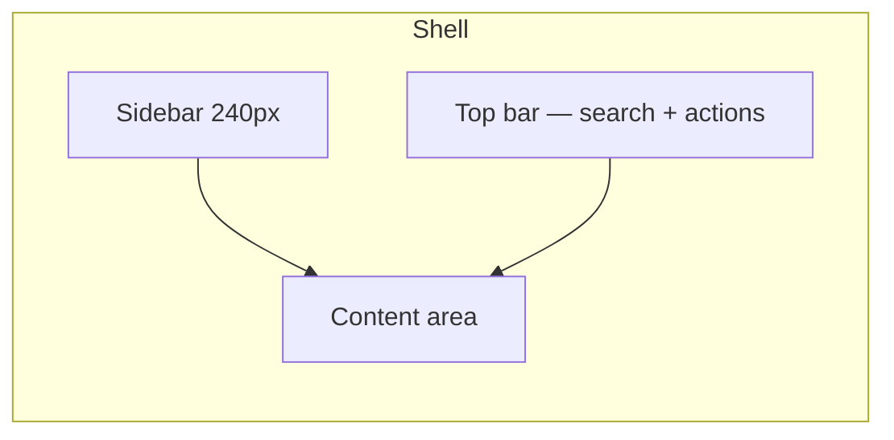

# ReconOS — UI/UX Design Guide

**Nomba API Hackathon 2026** · Design reference for judges and reviewers

---

## Design philosophy

ReconOS is a **payment operations** product, not a consumer app. The interface is designed for finance staff, bursars, and operations teams who need clarity under pressure — inspired by **Stripe Dashboard** and modern fintech admin UIs.

| Principle | How we apply it |
|-----------|-----------------|
| **Clarity over decoration** | Dense data presented in scannable cards and tables |
| **Trust through structure** | Consistent layout, predictable navigation, visible status |
| **Merchant-first language** | "Students" not "Nomba VA"; payment rail hidden in footer |
| **Progressive disclosure** | Summary stats → drill-down tables → expandable match details |
| **Mobile-ready operations** | Card layouts on phone/tablet; full tables on desktop (≥1024px) |

---

## Two visual modes

### 1. Marketing & auth (homepage, login, signup)

Dark/light theme toggle. Optimized for storytelling and conversion.

| Token | Dark mode | Light mode | Usage |
|-------|-----------|------------|--------|
| Brand blue | `#2563EB` | `#2563EB` | Logo, CTAs, links, awaiting-payment accent |
| Blue hover | `#1D4ED8` | `#1D4ED8` | Button hover |
| Blue accent | `#60A5FA` | `#60A5FA` | Highlights, gradients |
| Gradient CTA | `#2563EB` → `#7C3AED` | Same | Hero avatars, feature pills |
| Background | Deep navy / charcoal | White / off-white | Page shell |
| Text | High-contrast white/gray | `#111827` body | Headlines & copy |

**Homepage:** Split narrative — live payment event stream on the left, product story on the right. Animated phone mockup shows reconciliation in action.

**Auth page:** Split panel — brand story + live event ticker left; sign-in / create-account form right. Password strength meter, Google/Microsoft placeholders, industry onboarding after first login.

### 2. Merchant dashboard (app shell)

Stripe-inspired **light admin UI** — calm, professional, data-forward.

| Token | Hex | Usage |
|-------|-----|--------|
| Primary (charcoal) | `#111827` | Sidebar active state, primary buttons, headings |
| Background | `#F9FAFB` | Page canvas |
| Foreground | `#111827` | Body text |
| Border | `#E5E7EB` | Cards, tables, dividers |
| Muted text | `#6B7280` | Labels, secondary copy |
| Input bg | `#F9FAFB` | Form fields |
| Info blue | `#2563EB` | Links, payment-awaiting state, match references |
| Success | `#059669` | Paid, matched, wallet credit |
| Warning | `#D97706` | Review queue, partial |
| Danger | `#DC2626` | Overdue, exceptions, anomalies |

**Typography:** System stack — `-apple-system`, `Inter`, `Segoe UI`. Monospace for account numbers and payment references (`SF Mono`, `Fira Code`).

**Radius:** Cards `10px`, small controls `6px`, large panels `14px`.

**Shadow:** Subtle card shadow — `0 1px 3px rgba(0,0,0,0.07)` (Stripe-like elevation, not Material heavy).

---

## Layout architecture

### Sidebar navigation (grouped like Stripe)

| Section | Items |
|---------|--------|
| **Overview** | Dashboard |
| **Payments** | Treasury, Customers, Invoices, Transactions |
| **Operations** | Reconciliation, Exceptions, Activity, Timeline, AI Insights |
| **System** | Integrations, Event Simulator |

- Collapsible on mobile (hamburger)
- Badge counts for review queue, exceptions, open invoices
- Industry labels adapt ("Students" vs "Tenants")

### Top bar

- Global search placeholder
- Quick "New invoice" action
- User org context

### Page patterns

| Pattern | Used on |
|---------|---------|
| **Stat cards** (2×2 mobile, 4-col desktop) | Dashboard, Invoices, Customers, Statement |
| **Data tables** (desktop) | Invoices, Customers, Transactions |
| **Card lists** (mobile/tablet) | Same pages below 1024px |
| **Tab filters** | Invoice status, transaction status, activity |
| **Confidence bar** | Reconciliation, transactions |
| **Status badges** | Semantic colors per invoice/transaction state |
| **Modals** | Deliver payment link, confirm delete, overpayment resolve |

---

## Key screens

### Dashboard
- Today's collections, outstanding, needs-attention, auto-reconcile rate
- Weekly collections bar chart (charcoal bars on light grid)
- Live webhook event feed
- Recent transactions with expandable match-confidence breakdown

### Invoices
- Create invoice inline form with wallet-preview
- Status tabs: All, Pending, Paid, Overdue, Partial
- **Share / Remind** → Deliver Payment Modal (link, account number, copy actions)

### Customers
- Avatar initials, payment-readiness indicator (green = VA ready)
- Statement link, edit, delete
- Mobile: stacked cards with all fields

### Reconciliation Center
- Review queue with 4-signal confidence breakdown
- Confirm / override actions
- Overpayment disposition (refund, wallet, apply to future invoice)

### Public payment page (`/pay/{token}`)
- Customer-facing, no login
- Invoice summary, amount due, wallet credit applied
- Bank details + copy account number
- NQR QR code
- Live status: Awaiting → Confirming → Confirmed

### Treasury
- Org sub-account balance
- Bank lookup before withdrawal
- Settlement actions

### Activity & audit
- Chronological financial story per customer
- Operations audit (support mode) for technical event inspection

---

## Responsive behavior

| Breakpoint | Behavior |
|------------|----------|
| `< 1024px` (phone + tablet) | Tables → card lists; header actions wrap |
| `≥ 1024px` (desktop) | Full data tables unchanged |

Shell: hamburger sidebar, compact "+" invoice button on small screens.

---

## Motion & feedback

| Element | Animation |
|---------|-----------|
| New activity rows | `slide-in` (250ms) |
| Live webhook dot | `pulse-ring` |
| Confidence bars | Width transition 600ms |
| Page transitions | `pageFade` 150ms |
| Modals | Backdrop fade + panel spring |

Toast notifications via `react-hot-toast` for create/update/error states.

---

## Accessibility & copy

- Merchant vocabulary layer — Nomba/internal terms sanitized in UI
- Industry templates rename Customers/Invoices per vertical
- High contrast status badges (not color-only — text labels on every badge)
- Form validation with inline error messages on auth and create flows

---

## Design inspiration

| Reference | What we borrowed |
|-----------|------------------|
| **Stripe Dashboard** | Sidebar grouping, stat cards, table density, charcoal primary |
| **Linear** | Clean borders, minimal chrome |
| **Modern Nigerian fintech** | Naira formatting, bank transfer UX, dedicated VA copy |

---

## Live URLs

| Environment | URL |
|-------------|-----|
| **UI/UX guide (live page)** | https://recon-os-theta.vercel.app/design |
| **Frontend** | https://recon-os-theta.vercel.app |
| **API** | https://reconos-api.onrender.com/api |
| **Public pay example** | `/pay/{paymentToken}` from any invoice |
